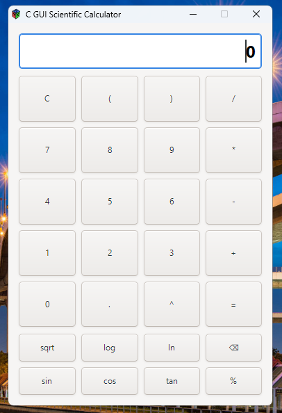

# 💡 Getting Started – C GUI Calculator

Welcome! This comprehensive guide will help you get up and running with the **C GUI Calculator** built using **GTK+ 3**. Whether you're a beginner or experienced developer, this guide provides detailed platform-specific instructions to clone, install dependencies, compile, and run the calculator successfully.

## 🎯 What You'll Learn

By following this guide, you will:

-   Set up a complete C development environment with GTK+ 3
-   Understand the compilation process for GUI applications in C
-   Learn platform-specific considerations and best practices
-   Troubleshoot common installation and compilation issues
-   Troubleshoot common installation and compilation issues

## 📦 Prerequisites & System Requirements

### Essential Components

Before compiling, ensure the following packages are installed on your system:

| Component      | Purpose                                     | Linux Package  | Windows (MSYS2)               | macOS (Homebrew) |
| -------------- | ------------------------------------------- | -------------- | ----------------------------- | ---------------- |
| `gcc`          | C compiler for building the application     | `gcc`          | `mingw-w64-x86_64-gcc`        | `gcc`            |
| `pkg-config`   | Manages compiler/linker flags for libraries | `pkg-config`   | `mingw-w64-x86_64-pkg-config` | `pkg-config`     |
| `libgtk-3-dev` | GTK+ 3 development files for GUI            | `libgtk-3-dev` | `mingw-w64-x86_64-gtk3`       | `gtk+3`          |

### System Requirements

-   **RAM**: Minimum 2GB (4GB recommended)
-   **Disk Space**: At least 500MB free space for development tools
-   **Operating System**:
    -   Linux: Any modern distribution (Ubuntu 18.04+, Fedora 30+, etc.)
    -   Windows: Windows 10/11 with MSYS2
    -   macOS: macOS 10.14+ with Homebrew

> 📋 **Note**: See our detailed [Requirements Guide](./Requirements.md) for comprehensive package information and alternative installation methods.

## 🚀 Step-by-Step Setup & Compilation

### 🔹 Step 1: Clone the Repository

First, clone the project repository to your local machine:

```bash
# Clone the repository
git clone https://github.com/rafisarkar0128/c-gui-calculator.git

# Navigate to the project directory
cd c-gui-calculator

# Verify the files are present
ls -la
```

**Expected output:**

```
main.c              # Main source code
README.md           # Project documentation
Getting-Started.md  # This guide
Requirements.md     # Detailed requirements
LICENSE             # MIT license
.gitignore          # Git ignore rules
```

### 🔹 Step 2: Install Development Dependencies

Choose the appropriate instructions for your operating system:

#### 📍 Linux (Debian/Ubuntu/Mint)

```bash
# Update package repository
sudo apt update && sudo apt upgrade -y

# Install essential development tools
sudo apt install build-essential

# Install GTK+ 3 development packages
sudo apt install gcc pkg-config libgtk-3-dev

# Optional: Install additional development tools
sudo apt install git vim nano

# Verify installation
gcc --version
pkg-config --modversion gtk+-3.0
```

**Expected GTK version:** 3.22 or higher

#### 📍 Linux (Fedora/CentOS/RHEL)

```bash
# Update system packages
sudo dnf update -y

# Install development tools group
sudo dnf groupinstall "Development Tools" -y

# Install GTK+ 3 development packages
sudo dnf install gcc pkgconf-pkg-config gtk3-devel

# Verify installation
gcc --version
pkg-config --modversion gtk+-3.0
```

#### 📍 Linux (Arch/Manjaro)

```bash
# Update system
sudo pacman -Syu

# Install base development packages
sudo pacman -S base-devel

# Install GTK+ 3
sudo pacman -S gtk3 pkg-config

# Verify installation
gcc --version
pkg-config --modversion gtk+-3.0
```

#### 📍 macOS (Homebrew)

**Prerequisites:** Install Homebrew if not already installed:

```bash
/bin/bash -c "$(curl -fsSL https://raw.githubusercontent.com/Homebrew/install/HEAD/install.sh)"
```

**Install development tools:**

```bash
# Install Xcode command line tools (if not already installed)
xcode-select --install

# Install required packages
brew install gcc pkg-config gtk+3

# Install XQuartz for X11 support (required for GTK on macOS)
brew install --cask xquartz

# Verify installation
gcc --version
pkg-config --modversion gtk+-3.0
```

> ⚠️ **Important for macOS users**:
>
> -   GTK applications require XQuartz to run properly
> -   You may need to log out and back in after installing XQuartz
> -   Consider using `brew install gtk+3` instead of `gtk3` if you encounter issues

#### 📍 Windows (MSYS2) - Recommended Method

**Step 2.1:** Download and install MSYS2 from [msys2.org](https://www.msys2.org/)

**Step 2.2:** Launch MSYS2 and update the system:

```bash
# Update package database and core system packages
pacman -Syu

# Close terminal when prompted, then reopen and run:
pacman -Su
```

**Step 2.3:** Install development tools:

```bash
# Install base development tools
pacman -S base-devel

# Install MinGW-w64 toolchain and GTK+ 3
pacman -S mingw-w64-x86_64-gcc mingw-w64-x86_64-pkg-config mingw-w64-x86_64-gtk3

# Optional: Install additional useful tools
pacman -S mingw-w64-x86_64-gdb git nano vim

# Verify installation
gcc --version
pkg-config --modversion gtk+-3.0
```

**Step 2.4:** Set up environment:

```bash
# Add MinGW64 to your PATH (add to ~/.bashrc for persistence)
export PATH="/mingw64/bin:$PATH"

# Verify the environment
echo $PATH
which gcc
```

> 💡 **Windows Alternative**: You can also use **Code::Blocks with MinGW** or **Visual Studio with vcpkg**, but MSYS2 is recommended for its simplicity and package management.

### 🔹 Step 3: Verify Your Development Environment

Before compiling, let's verify that all components are properly installed:

```bash
# Check GCC compiler
gcc --version
# Expected: gcc (GCC) 9.0 or higher

# Check pkg-config
pkg-config --version
# Expected: 0.29 or higher

# Check GTK+ 3 installation
pkg-config --modversion gtk+-3.0
# Expected: 3.22.0 or higher

# List GTK+ compile flags (should show multiple -I include paths)
pkg-config --cflags gtk+-3.0

# List GTK+ linker flags (should show multiple -l library flags)
pkg-config --libs gtk+-3.0
```

### 🔹 Step 4: Compile the Calculator

Now let's compile the calculator application:

#### Basic Compilation

```bash
# Navigate to the project directory (if not already there)
cd c-gui-calculator

# Compile with basic optimization
gcc -o calculator main.c `pkg-config --cflags --libs gtk+-3.0` -lm

# Check if compilation was successful
ls -la calculator*
```

#### Advanced Compilation (Recommended for Development)

```bash
# Compile with debugging symbols and warnings
gcc -Wall -Wextra -g -o calculator main.c `pkg-config --cflags --libs gtk+-3.0` -lm

# Or with optimization for release
gcc -O2 -o calculator main.c `pkg-config --cflags --libs gtk+-3.0` -lm
```

#### Platform-Specific Compilation Notes

**Linux/macOS:**

```bash
gcc -o calculator main.c `pkg-config --cflags --libs gtk+-3.0` -lm
```

**Windows (MSYS2):**

```bash
# In MSYS2 MinGW64 terminal
gcc -o calculator.exe main.c `pkg-config --cflags --libs gtk+-3.0` -lm
```

> 🧠 **Explanation of flags:**
>
> -   `-lm`: Links the math library (required for mathematical functions)
> -   `--cflags`: Includes compiler flags for GTK+ headers
> -   `--libs`: Includes linker flags for GTK+ libraries
> -   `-Wall -Wextra`: Enables additional compiler warnings
> -   `-g`: Includes debugging information
> -   `-O2`: Enables optimization level 2

### 🔹 Step 5: Run the Calculator

#### Linux/macOS:

```bash
# Run the calculator
./calculator

# If you get permission errors, make it executable first:
chmod +x calculator
./calculator
```

#### Windows (MSYS2):

```bash
# Run in MSYS2 terminal
./calculator.exe

# Or double-click the calculator.exe file in File Explorer
```

#### Expected Behavior

When successful, you should see:

1. A calculator window opens with a clean, modern interface
2. Number buttons (0-9), operation buttons (+, -, \*, /, ^)
3. Scientific function buttons (sin, cos, tan, sqrt, log, ln)
4. A display showing "0" initially
5. Responsive button clicks and keyboard shortcuts (Enter, Backspace)



> 📸 If the calculator doesn't look right or crashes, see the troubleshooting section below.

## 🛠️ Troubleshooting

-   Ensure your system’s package manager is up to date.
-   If `pkg-config` reports missing paths, verify GTK installation.
-   Windows users: Make sure MSYS2’s shell uses the `mingw-w64` environment, not the default `msys`.

## 📚 Additional Resources & References

### Official Documentation

-   **[GTK+ 3 Documentation](https://docs.gtk.org/gtk3/)** - Complete API reference and tutorials
-   **[GCC Manual](https://gcc.gnu.org/onlinedocs/)** - Compiler documentation and options
-   **[pkg-config Guide](https://www.freedesktop.org/wiki/Software/pkg-config/)** - Package configuration tool documentation

### Platform-Specific Resources

-   **[MSYS2 Documentation](https://www.msys2.org/)** - Windows development environment setup
-   **[Homebrew Documentation](https://docs.brew.sh/)** - macOS package manager
-   **[Ubuntu Development Guide](https://help.ubuntu.com/community/CompilingEasyHowTo)** - Linux compilation basics

### Learning Resources

-   **[GTK+ 3 Tutorial](https://developer.gnome.org/gtk3/stable/gtk-getting-started.html)** - Official GTK+ getting started guide
-   **[C Programming Tutorial](https://www.learn-c.org/)** - Interactive C programming course
-   **[Mathematical Expression Parsing](https://en.wikipedia.org/wiki/Shunting_yard_algorithm)** - Understanding the algorithm used in this calculator

### Development Tools

-   **[Visual Studio Code](https://code.visualstudio.com/)** - Recommended code editor with C/C++ extensions
-   **[GDB Debugger](https://www.gnu.org/software/gdb/)** - For debugging C applications
-   **[Valgrind](https://valgrind.org/)** - Memory error detection tool (Linux/macOS)

### Community & Support

-   **[Project Repository](https://github.com/rafisarkar0128/c-gui-calculator)** - Source code and issue tracker
-   **[GTK Community](https://discourse.gnome.org/)** - GTK+ development community
-   **[Stack Overflow](https://stackoverflow.com/questions/tagged/gtk)** - Programming Q&A with GTK tag

---

## 🎉 Congratulations!

If you've successfully followed this guide, you now have:

-   ✅ A complete C development environment with GTK+ 3
-   ✅ A working scientific calculator application
-   ✅ Understanding of the compilation process
-   ✅ Knowledge to troubleshoot common issues

**Next Steps:**

1. Explore the calculator's features and test different mathematical expressions
2. Read through the source code in `main.c` to understand the implementation
3. Try modifying the code to add new features or customize the interface
4. Share your experience or contribute improvements to the project

**Need more help?** Check our [comprehensive README](./README.md) or [create an issue](https://github.com/rafisarkar0128/c-gui-calculator/issues/new) on GitHub.

Happy coding! 🚀
